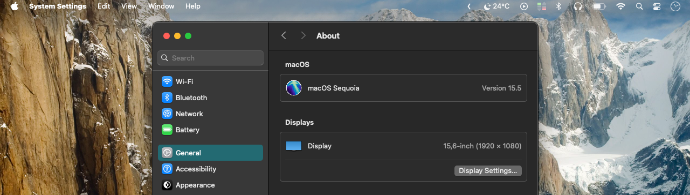

# Clear Menu Bar

> Make the macOS menu bar transparent.

## Features

- Supports single wallpaper or multiple wallpapers in a folder;
- Supports light and dark mode.

## Requirements

- The Reduce Transparency option must be enabled in the Accessibility options in the System Settings for this app to work as expected.
- The wallpaper needs to be set with the "Fill Screen" option.
- The wallpaper needs to be a static image. This app will not work with dynamic or aerial wallpapers.

## Contributing

This app was developed and tested on an old Intel Mac running macOS Sequoia. Feel free to update the source code to adapt this app to work on newer Macs with Apple Silicon and notch display. Pull requests are welcome.

## License
[GNU General Public License](https://github.com/zorth64/ClearMenuBar/blob/master/LICENSE)